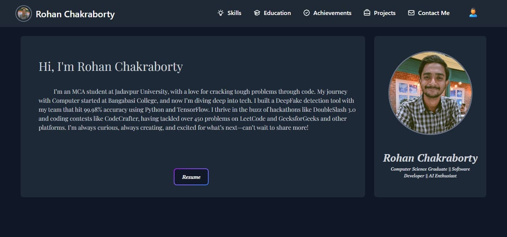

# Rohan's Portfolio

[](https://github.com/rohannc/My_Portfolio/stargazers)
[](https://github.com/rohannc/My_Portfolio/network/members)
[](https://github.com/rohannc/My_Portfolio/issues)
[](https://github.com/rohannc/My_Portfolio/blob/main/LICENSE)

## 📋 Overview

Welcome to my professional developer portfolio! This repository showcases my academic journey, technical skills, competitive programming achievements, and engineering projects in a sleek, responsive web application.

[Live Demo](https://rohann.xyz)



## ✨ Features

- **Sleek Minimalist Dark UI**: Built with modern typography, glassmorphism cards, and subtle glow accents
- **Centralized Data Store**: All content (projects, achievements, skills, credentials) is managed cleanly via `src/data/portfolioData.js`
- **Responsive Navigation**: Glassmorphic sticky header with active scroll-section detection and mobile drawer menu
- **Interactive Project Showcase**: Deep dive into the DeepFake Image Detection System with screenshot carousel and research team highlights
- **Filterable Achievements**: Competitive honors filterable by wins, runner-up, and entrance exams
- **Connected Academic Timeline**: Clean chronology of education at Jadavpur University, Bangabasi College, and high school
- **Direct EmailJS Integration**: Interactive contact form with client-side feedback and validation

## 🛠️ Technologies Used

- **Frontend**: Vue.js 3 (Composition API / `<script setup>`), Tailwind CSS v4, Swiper.js
- **Services**: EmailJS (`@emailjs/browser`)
- **Tooling & Bundler**: Vite 6
- **Typography**: Inter & JetBrains Mono

## 🚀 Installation & Setup

1. **Clone the repository**
   ```bash
   git clone https://github.com/rohannc/My_Portfolio.git
   cd My_Portfolio
   ```

2. **Install dependencies**
   ```bash
   npm install
   ```

3. **Run development server**
   ```bash
   npm run dev
   ```

4. **Build for production**
   ```bash
   npm run build
   ```

5. **Preview production build**
   ```bash
   npm run preview
   ```

## 📂 Project Structure

```
My_Portfolio/
├── public/
├── src/
│   ├── assets/             # Project screenshots, avatars & preview media
│   ├── components/         # Modular Vue 3 components
│   │   ├── AboutMe.vue     # Hero section & core engineering focus
│   │   ├── Achievements.vue # Honors, competitions & state ranks
│   │   ├── ContactMe.vue   # Contact channels & EmailJS form
│   │   ├── Education.vue   # Connected academic timeline
│   │   ├── Footer.vue      # Footer & quick navigation
│   │   ├── NavbarCustomized.vue # Glass navbar with section tracking
│   │   ├── Project.vue     # Featured project deep-dive & Swiper slider
│   │   └── Skills.vue      # Categorized technical competencies
│   ├── data/
│   │   └── portfolioData.js # Centralized portfolio content
│   ├── App.vue             # Root component
│   ├── main.js             # Vue application bootstrap
│   └── style.css           # Tailwind v4 theme & glassmorphic utilities
├── index.html              # HTML5 entry with SEO tags & fonts
├── package.json            # Project dependencies & scripts
├── vite.config.js          # Vite configuration
└── README.md
```

## 📬 Contact & Socials

- **Email**: [chakrabortyrohan.abc01@gmail.com](mailto:chakrabortyrohan.abc01@gmail.com)
- **LinkedIn**: [rohanchakraborty0108](https://www.linkedin.com/in/rohanchakraborty0108/)
- **GitHub**: [rohannc](https://github.com/rohannc)
- **Codolio**: [Rohann](https://codolio.com/profile/Rohann)

---

⭐️ Maintained by [Rohan Chakraborty](https://github.com/rohannc)
